<div align="center">



# Hey, I'm Arpita! ✨

### Computer Science Student • Builder • AI Explorer • Creative Technologist

<p align="center">
  <a href="https://github.com/ArpitaM27">
    
  </a>
  <a href="https://www.linkedin.com/in/arpita-mahapatra-b19451280/">
    
  </a>
  <a href="mailto:lipsha2712@gmail.com">
    
  </a>
</p>

</div>

---

### 🌱 A little about me

> **"Build things. Break things. Learn why they broke."**

I'm a **Computer Science undergraduate and builder** exploring the intersection of software engineering, AI, product development, and design.

I enjoy building things that solve real problems — not just projects that look good on a resume.

Currently exploring **backend engineering, AI/ML, system design, cloud, and product development**, while sharpening my problem-solving skills through DSA.

When I'm not coding, I'm probably **writing, designing, reading, or turning a random idea into a slightly-too-ambitious project.** 🚀

---

<div align="center">



</div>

<div align="center">

<a href="#-artificial-intelligence">

</a>

<a href="#-featured-builds">

</a>

<a href="#-creative-corner">

</a>

<a href="#-tech-stack">

</a>

</div>

---

## ✦ Artificial Intelligence

I'm fascinated by systems that can **perceive, reason, retrieve, and act.**

```text
Machine Learning
      ↓
Generative AI
      ↓
RAG & LLMs
      ↓
AI Agents
      ↓
Computer Vision

<div align="center">

I don't build projects just to learn a technology.

I build things to understand what happens when an idea
survives contact with reality.

</div>
🚀 Featured Builds
<table> <tr> <td width="33%" valign="top"> <h3>🧮 Maths Beyond Classroom</h3> <p> Full-stack Olympiad mathematics platform for structured learning, practice, and assessment. </p>

<code>React</code>
<code>Express</code>
<code>Prisma</code>
<code>PostgreSQL</code>

<br><br>

<a href="https://github.com/ArpitaM27/Maths-Beyond-Classroom"> <b>→ Source</b> </a> </td> <td width="33%" valign="top"> <h3>🛒 Baazario</h3> <p> Digital supply platform designed to help street food vendors coordinate bulk purchasing and suppliers. </p>

<code>Node.js</code>
<code>Express</code>
<code>MongoDB</code>
<code>JWT</code>

<br><br>

<a href="https://github.com/ArpitaM27/Baazario"> <b>→ Source</b> </a> </td> <td width="33%" valign="top"> <h3>📓 DSA Diary</h3> <p> My growing LeetCode journey — problems, patterns, approaches, mistakes, and lessons. </p>

<code>Python</code>
<code>DSA</code>
<code>LeetCode</code>

<br><br>

<a href="https://github.com/ArpitaM27/Dsa-Diary"> <b>→ View Diary</b> </a> </td> </tr> </table>
🛰️ Mission Log
<p align="center"> <i>Not a roadmap. Just the direction I'm heading.</i> </p> <div align="center">
2025
│
└── FINDING THE SIGNAL
    Competitions · Design · Writing · Experiments
    │
    ▼
2026
│
└── BUILDING THE FOUNDATION
    Backend · AI · DSA · Product
    │
    ├── 🧮 Maths Beyond Classroom
    ├── 🛒 Baazario
    └── 📓 DSA Diary
    │
    ▼
    CURRENT ORBIT
    │
    ├── 🧠 AI Engineering
    ├── ⚙️ Backend Systems
    ├── 🧩 DSA
    └── 🚀 Product Building
    │
    ├── Incoming → IntelliMail
    └── Incoming → HandSign AI
    │
    ▼
2027
│
└── GOING DEEPER
    Systems · AI Engineering · Cloud · Architecture
    │
    ▼
    ???? 
    wherever the building takes me.
</div>
👩🏻‍💻 A little beyond code
<p align="center"> <i>Technology is one of the things I love. It's not the only one.</i> </p> <div align="center">

🎨 UI/UX
✍️ Writing
🎬 Film
📖 Storytelling

</div> <p align="center"> I write short stories, poetry & screenplays, <br> experiment with visual ideas, <br> and turn random thoughts into projects. </p> <div align="center">

<i>Making things functional is fun.<br>
Making them memorable is better.</i>

</div>
🚀 Tech Stack
<p align="center"> <i>The tools I use to turn ideas into things that actually work.</i> </p> <p align="center">  </p> <p align="center">  </p> <p align="center">  </p>
📊 GitHub Telemetry
<p align="center"> <i>A small window into the things I build every day.</i> </p> <br> <div align="center">


<br><br>


<br><br>


</div>
🐍 Contribution Journey
<p align="center"> <i>Every contribution leaves a trace.</i> </p> <div align="center">


</div>
<div align="center"> 

<br><br>

🌌 Still building. Still learning. Still curious.

Code • Create • Learn • Repeat

</div> ```